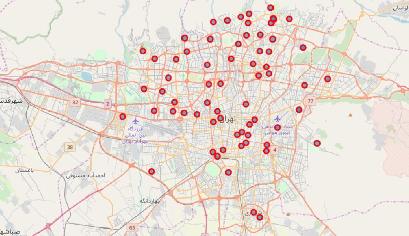

# 🗺️ Tehran Venue Clustering – Data Science Capstone

This project clusters neighborhoods across the 22 districts of **Tehran** based on their top venues using **unsupervised learning**. It was developed as part of a data science capstone to address the lack of publicly accessible venue-based insights for different parts of the city.

  
   <em>Example: Districts of Tehran clustered by neighborhood venue data</em>

---

## 📌 Problem

Despite its size and diversity, **Tehran** lacks structured venue analysis at the neighborhood level. Tourists and newcomers struggle to understand which parts of the city offer specific types of venues. This project aims to:
- Collect data on venues in all Tehran neighborhoods
- Cluster them based on venue types
- Visualize the results to guide newcomers and businesses

---

## 📍 Methodology

- **Data Collection**:
  - District and neighborhood names gathered manually from Wikipedia
  - Coordinates obtained using the **Geopy** library
  - Venue data sourced from **Foursquare API**
  
- **Processing**:
  - Cleaned and geocoded neighborhoods
  - Gathered top 10 venues per neighborhood
  - Merged all data into a structured DataFrame

- **Clustering**:
  - Frequency analysis of venue types per neighborhood
  - Used **K-Means clustering**
  - Optimal number of clusters selected via **Elbow Method**
  - Visualized the results on an interactive map using **Folium**

---

## 📊 Tools & Technologies

- Python
- Pandas, NumPy
- Scikit-learn (K-Means)
- Geopy
- Folium
- Foursquare API

---

## 🧠 Key Insights

- Northern districts of Tehran show **higher venue density**, especially for **leisure and commercial spots**
- Southern and peripheral neighborhoods have **fewer** and **less diverse venues**
- Businesses targeting **tourism** or **high-traffic areas** should focus on **north-central neighborhoods**

---

## 🗺️ Use Cases

- 🧳 **Tourists** looking to identify hotspots in Tehran
- 💼 **Entrepreneurs** evaluating commercial activity across districts
- 🏙️ **City planners** analyzing the spatial distribution of public venues

---

## 📄 License

This project is licensed under the **MIT License**.  
Feel free to use, modify, or distribute it with appropriate attribution.
